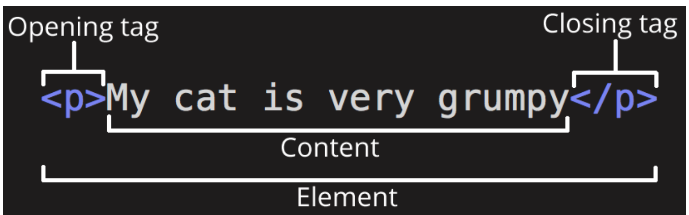
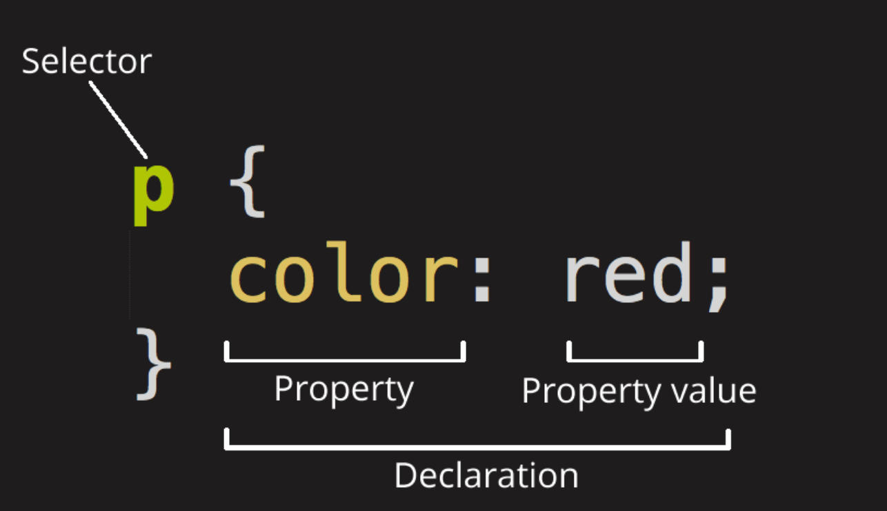

这是一个简要的web前端介绍

<!--truncate-->

*以下内容主要来自[MDN](https://developer.mozilla.org/en-US/docs/Learn/Getting_started_with_the_web/Dealing_with_files)以及个人理解*
### 1. 文件命名规范建议
1. 杜绝空格：不同的操作系统对于文件名中的空格处理是不一样的，比如有的会将带空格的文字当做两个文件来处理，有的会用空格编码来替代空格
2. 采用小写：不是所有的系统都是大小写敏感的
3. 最好采用连字符`-`作为词间隔：谷歌搜索会根据连字符把词拆开
### 2. HTML基础知识
#### 2.1. 什么是HTML？  
HTML是一种标记语言，用来结构化描述网页内容；HTML首次公开描述于1991年
>HTML is not a programming language; it is a markup language that defines the structure of your content.  

#### 2.2. HTML的组成
1. HTML(Hypertext Markup Language)由元素<u>element</u>组成，一个element的核心在于描述类型的<u>tag</u>  
2. tag的类型有两种，一种是闭合的tag，例如`<p></p>`，中间可以存放文本或者其它的element，另一种是empty tag，直接就是闭合的tag，如``  

3. tag都有左右闭合的尖角括号，括号内除了本身的tag名(*如p/img*)，还可以填入属性，如`img`标签的`src`，属性的格式为 **属性名=“属性值”**，属性之间以空格分开。
```HTML

```
4. element是相互嵌套的，子element一定是不会超过父element界限的，不存在同一层级不同子element范围的相互重叠。
### 3. CSS基础知识
#### 3.1. 什么是CSS
>Like HTML, CSS is not really a programming language. It is not a markup language either — it is a style sheet language.   

它的意义在于能够赋给HTML中的element样式
#### 3.2. CSS的组成
1. CSS(Cascading Style Sheets)的核心思想就是通过一个选择器选择出需要赋予样式的元素，然后给这些元素赋予一系列的样式规则。当然，我们可以直接在HTML的tag当中，但这样的问题一个是只能style一个具体的元素，无法style多个元素；二是在tag里面写大量的样式属性会极大的降低可读性，维护性也会变差。
 
2. 页面的总样式就是一个个box的相互覆盖
#### 3.3. css语法
- 一系列css rule的集合。
- 如果一条css声明无效，那么该条语句会被跳过，不会报错。

### 4. DOM与HTML、CSS
> 1. The browser converts HTML and CSS into the DOM (Document Object Model). The DOM represents the document in the computer's memory. It combines the document's content with its style.
> 2. The browser displays the contents of the DOM.

每一个元素、属性、文本都是DOM节点。


